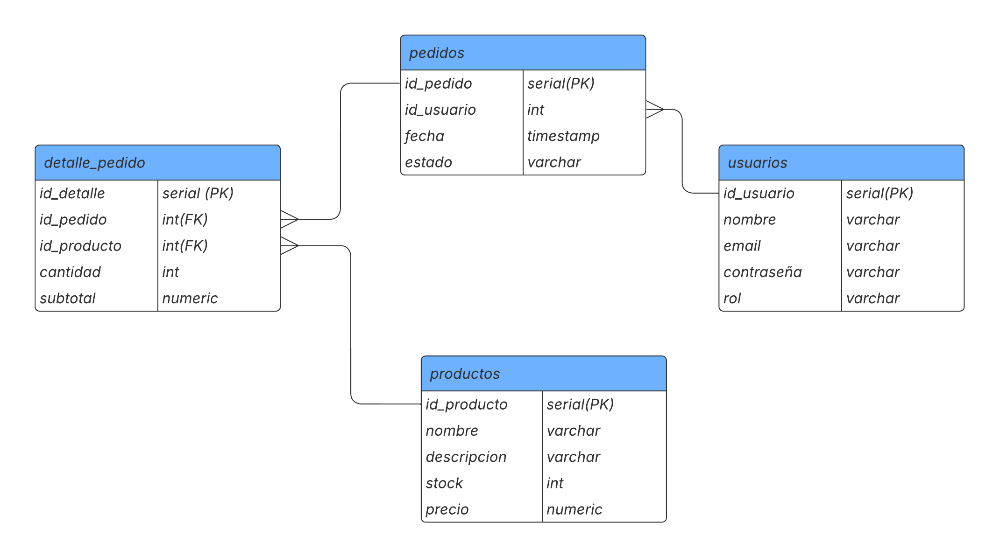
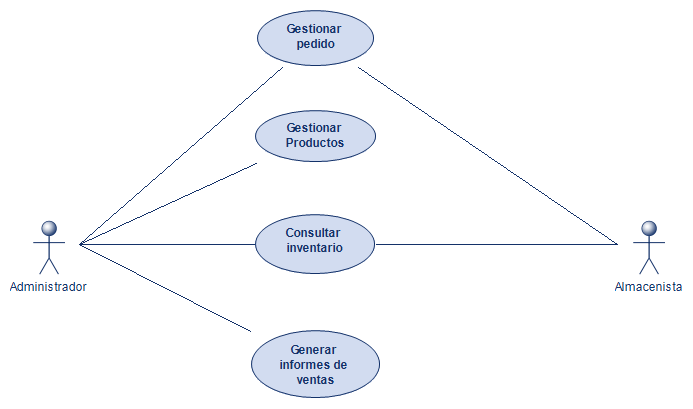
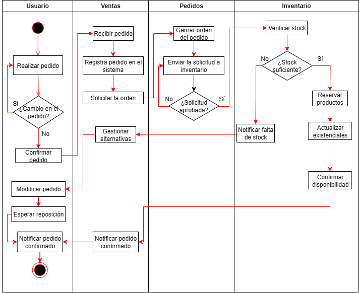

# LicoMart---SII

Repositorio para el proyecto de software 2, donde se realiza un software de gestión de ventas de cualquier negocio, en este caso licores.

---

## Diagramas 📊

### 1. Diagrama de Base de Datos

### 2. Diagrama de Casos de Uso

### 3. Diagrama de Actividades

